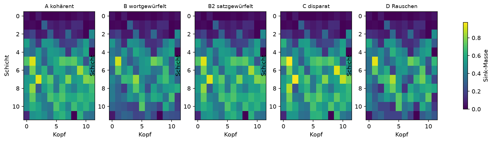
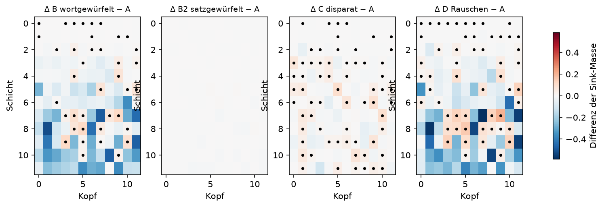

# Auswertung: gpt2 @ final

n = 300 Sequenzen pro Bedingung, N = 256, skip = 8, 12 Schichten × 12 Köpfe, 5000 Permutationen, 2000 Bootstraps.

## Übersicht

| Bedingung | Sink-Masse (95%-KI) | Ausgabe-Entropie | Loss |
|---|---|---|---|
| A kohärent | 0.4066 (0.4045–0.4087) | 3.537 | 3.471 |
| B wortgewürfelt | 0.3271 (0.3248–0.3292) | 6.424 | 6.850 |
| B2 satzgewürfelt | 0.4060 (0.4040–0.4079) | 3.625 | 3.621 |
| C disparat | 0.4124 (0.4113–0.4135) | 4.142 | 4.431 |
| D Rauschen | 0.3335 (0.3327–0.3344) | 7.534 | 8.547 |

Kontrolle: Der Loss sollte in A am niedrigsten und in D am höchsten sein. Ein auffällig niedriger Loss in A deutet auf auswendig gelernte Texte hin.

## H1: Asynchronizität erhöht die Sink-Masse

| Vergleich | Differenz | 95%-KI | p (einseitig) |
|---|---|---|---|
| B > A | -0.0795 | -0.0825 bis -0.0765 | 1.0000 |
| B2 > A | -0.0006 | -0.0034 bis +0.0022 | 0.6475 |
| C > A | +0.0058 | +0.0035 bis +0.0081 | 0.0002 |
| D > A | -0.0730 | -0.0754 bis -0.0708 | 1.0000 |
| D > B | +0.0065 | +0.0041 bis +0.0088 | 0.0002 |
| D > C | -0.0788 | -0.0802 bis -0.0774 | 1.0000 |

## Kopfweise Differenzen zu A (Benjamini-Hochberg, α = 0,05)

- B wortgewürfelt: 39 von 144 Köpfen signifikant erhöht
- B2 satzgewürfelt: 0 von 144 Köpfen signifikant erhöht
- C disparat: 64 von 144 Köpfen signifikant erhöht
- D Rauschen: 54 von 144 Köpfen signifikant erhöht

## H2: Folge und Art treiben verschiedene Köpfe in den Sink

- Schichtschwerpunkt ΔB (Folge zerstört): 6.64
- Schichtschwerpunkt ΔC (Art zerstört): 6.83
- Differenz C − B: +0.19 (95%-KI -0.04 bis +0.42); Vorhersage: positiv
- Korrelation der Karten ΔB und ΔC: r = -0.32 (95%-KI -0.40 bis -0.24); Vorhersage: schwach

Schichten sind ab 0 gezählt. Das Bootstrap resampelt A und B unabhängig, obwohl B aus A abgeleitet ist; die Intervalle sind daher eher konservativ.

## Grafiken

Punkte markieren Köpfe, die nach BH-Korrektur signifikant erhöht sind.