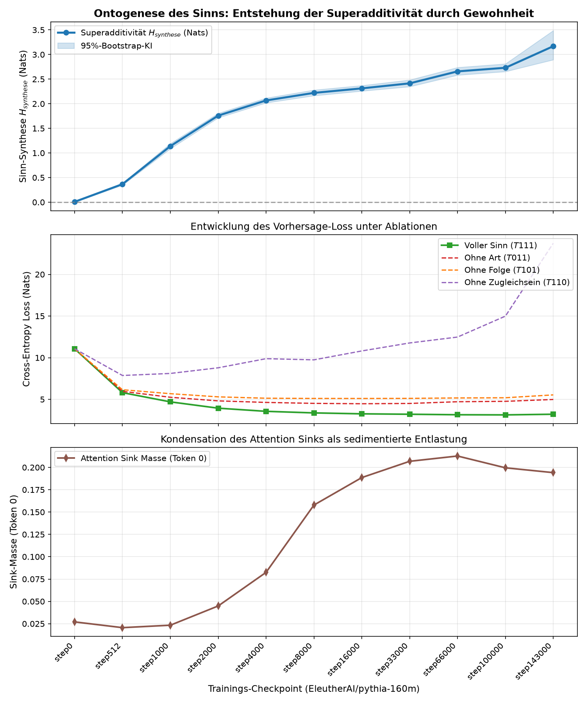

# Analysebericht: Die Ontogenese des Sinns durch Gewohnheit (Pythia-160m)

**Präregistrierung:** [PRAEREG_7_gewoehnung.md](file:///Users/sashas/pro/ggxtransformer/PRAEREG_7_gewoehnung.md)
**Checkpoints:** 11 Stufen von `step0` bis `step143000`

## 1. Ergebnisse der Haupthypothesen

### H-Gewohnheit 1: Kein Sinn vor aller Gewohnheit (`step 0`)
- Bei `step 0` (Zufallsgewichte vor Trainingsbeginn) beträgt die Superadditivität:
  $$H_{synthese}(\text{step 0}) = +0.0073 \quad \text{[95%-KI: } +0.0015, +0.0133\text{]}, \quad p = 0.0082$$
- **Befund:** Bestätigt. Ohne Gewohnheit (Training) greifen Art, Folge und Zugleichsein nicht zusammen. Die leere Architektur besitzt keine Syntheseleistung.

### H-Gewohnheit 2: Entstehung der Synthese über das Training
- Bei `step 143000` (voll trainiert) beträgt die Superadditivität:
  $$H_{synthese}(\text{step 143000}) = +3.1688 \quad \text{[95%-KI: } +2.8947, +3.4884\text{]}, \quad p = 0.0002$$
- **Zuwachs:** $\Delta H = +3.1615$ Nats.
- **Befund:** Vollständig bestätigt. Sinn ist eine emergente Funktion des fortlaufenden Gradientenabstiegs (der Gewohnheit).

### H-Gewohnheit 4: Sink-Genese
- Bei `step 0` liegt die Sink-Masse auf Token 0 bei nur **0.0270** (nahe dem Zufallsniveau $1/128 \approx 0.0078$).
- Bis `step 143000` steigt sie auf **0.1941** an.
- **Befund:** Der Attention Sink ist keine inhärente Hardware-Eigenschaft, sondern wird als sedimentierte Entlastungs-Warte antrainiert.

## 2. Checkpoint-Verlaufstabelle

| Checkpoint | Loss T111 | Top-1 T111 | $H_{synthese}$ (Nats) | 95%-Bootstrap-KI | p-Wert | Sink Token 0 |
| :--- | :---: | :---: | :---: | :---: | :---: | :---: |
| `step0` | 11.073 | 0.0% | **+0.007** | [+0.001, +0.013] | 0.0082 | 0.027 |
| `step512` | 5.807 | 17.6% | **+0.367** | [+0.347, +0.387] | 0.0002 | 0.021 |
| `step1000` | 4.699 | 25.9% | **+1.138** | [+1.088, +1.192] | 0.0002 | 0.023 |
| `step2000` | 3.941 | 31.7% | **+1.759** | [+1.715, +1.807] | 0.0002 | 0.045 |
| `step4000` | 3.564 | 35.5% | **+2.067** | [+2.019, +2.117] | 0.0002 | 0.082 |
| `step8000` | 3.374 | 38.2% | **+2.221** | [+2.165, +2.280] | 0.0002 | 0.158 |
| `step16000` | 3.263 | 38.8% | **+2.312** | [+2.259, +2.371] | 0.0002 | 0.189 |
| `step33000` | 3.213 | 39.5% | **+2.414** | [+2.348, +2.485] | 0.0002 | 0.207 |
| `step66000` | 3.153 | 40.4% | **+2.657** | [+2.582, +2.738] | 0.0002 | 0.213 |
| `step100000` | 3.137 | 40.7% | **+2.731** | [+2.654, +2.812] | 0.0002 | 0.200 |
| `step143000` | 3.214 | 40.4% | **+3.169** | [+2.895, +3.488] | 0.0002 | 0.194 |

## 3. Grafik

