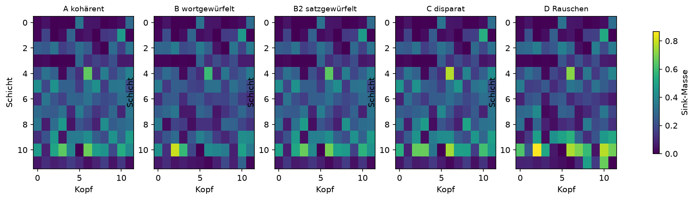
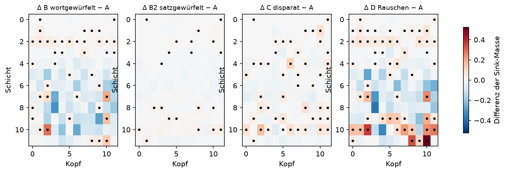

# Auswertung: EleutherAI/pythia-160m @ step143000

n = 300 Sequenzen pro Bedingung, N = 256, skip = 8, 12 Schichten × 12 Köpfe, 5000 Permutationen, 2000 Bootstraps.

Korpus: Textordner wiki_texte, 600 Dateien, mit quellen.csv, gebaut am 2026-09-23 13:24

## Übersicht

| Bedingung | Sink-Masse (95%-KI) | Ausgabe-Entropie | Loss |
|---|---|---|---|
| A kohärent | 0.2152 (0.2127–0.2177) | 3.227 | 3.047 |
| B wortgewürfelt | 0.1849 (0.1828–0.1871) | 6.072 | 6.595 |
| B2 satzgewürfelt | 0.2134 (0.2109–0.2160) | 3.376 | 3.236 |
| C disparat | 0.2186 (0.2167–0.2206) | 4.038 | 4.234 |
| D Rauschen | 0.2079 (0.2056–0.2104) | 7.296 | 11.299 |

Kontrolle: Der Loss sollte in A am niedrigsten und in D am höchsten sein. Ein auffällig niedriger Loss in A deutet auf auswendig gelernte Texte hin.

## H1: Asynchronizität erhöht die Sink-Masse

| Vergleich | Differenz | 95%-KI | p (einseitig) |
|---|---|---|---|
| B > A | -0.0303 | -0.0336 bis -0.0270 | 1.0000 |
| B2 > A | -0.0018 | -0.0053 bis +0.0015 | 0.8470 |
| C > A | +0.0034 | +0.0001 bis +0.0066 | 0.0176 |
| D > A | -0.0073 | -0.0109 bis -0.0038 | 1.0000 |
| D > B | +0.0230 | +0.0197 bis +0.0265 | 0.0002 |
| D > C | -0.0107 | -0.0138 bis -0.0077 | 1.0000 |

## Kopfweise Differenzen zu A (Benjamini-Hochberg, α = 0,05)

- B wortgewürfelt: 42 von 144 Köpfen signifikant erhöht
- B2 satzgewürfelt: 21 von 144 Köpfen signifikant erhöht
- C disparat: 47 von 144 Köpfen signifikant erhöht
- D Rauschen: 56 von 144 Köpfen signifikant erhöht

## H2: Folge und Art treiben verschiedene Köpfe in den Sink

- Schichtschwerpunkt ΔB (Folge zerstört): 7.15
- Schichtschwerpunkt ΔC (Art zerstört): 7.11
- Differenz C − B: -0.04 (95%-KI -0.19 bis +0.11); Vorhersage: positiv
- Korrelation der Karten ΔB und ΔC: r = 0.11 (95%-KI 0.06 bis 0.16); Vorhersage: schwach

Schichten sind ab 0 gezählt. Das Bootstrap resampelt A und B unabhängig, obwohl B aus A abgeleitet ist; die Intervalle sind daher eher konservativ.

### Ersatzmaß |Δ| (explorativ, nicht präregistriert)

- Schwerpunkt |ΔB| (Folge zerstört): 7.53
- Schwerpunkt |ΔC| (Art zerstört): 7.04
- Differenz C − B: -0.49 (95%-KI -0.58 bis -0.39)

Das präregistrierte Maß oben wertet nur positive Differenzen und liefert deshalb je nach Lauf ein anderes Vorzeichen, sobald eine Bedingung überwiegend negativ wirkt. Dieses Maß nutzt die volle Wirkungstiefe unabhängig vom Vorzeichen. Es wurde nach Kenntnis der Daten definiert und ist damit explorativ; ein konfirmatorischer Test verlangt einen neuen Lauf.

## Grafiken

Punkte markieren Köpfe, die nach BH-Korrektur signifikant erhöht sind.