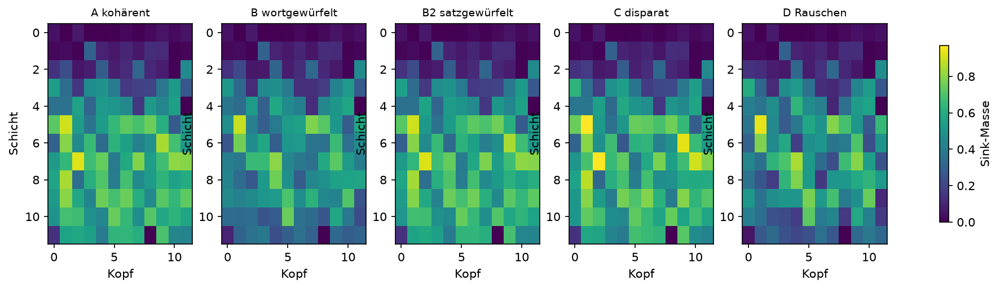
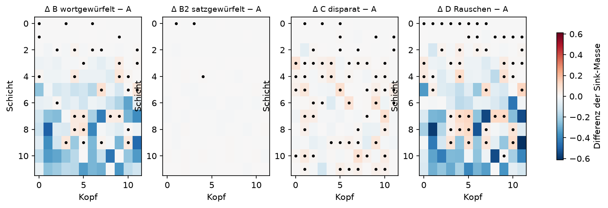

# Auswertung: gpt2 @ final

n = 300 Sequenzen pro Bedingung, N = 256, skip = 8, 12 Schichten × 12 Köpfe, 5000 Permutationen, 2000 Bootstraps.

Korpus: Textordner wiki_texte, 600 Dateien, mit quellen.csv, gebaut am 2026-09-23 13:24

## Übersicht

| Bedingung | Sink-Masse (95%-KI) | Ausgabe-Entropie | Loss |
|---|---|---|---|
| A kohärent | 0.4280 (0.4260–0.4299) | 3.323 | 3.140 |
| B wortgewürfelt | 0.3457 (0.3436–0.3481) | 6.107 | 6.552 |
| B2 satzgewürfelt | 0.4273 (0.4254–0.4292) | 3.454 | 3.321 |
| C disparat | 0.4344 (0.4333–0.4356) | 4.148 | 4.401 |
| D Rauschen | 0.3420 (0.3411–0.3429) | 7.667 | 8.758 |

Kontrolle: Der Loss sollte in A am niedrigsten und in D am höchsten sein. Ein auffällig niedriger Loss in A deutet auf auswendig gelernte Texte hin.

## H1: Asynchronizität erhöht die Sink-Masse

| Vergleich | Differenz | 95%-KI | p (einseitig) |
|---|---|---|---|
| B > A | -0.0823 | -0.0853 bis -0.0792 | 1.0000 |
| B2 > A | -0.0007 | -0.0034 bis +0.0021 | 0.6859 |
| C > A | +0.0064 | +0.0042 bis +0.0087 | 0.0002 |
| D > A | -0.0860 | -0.0881 bis -0.0838 | 1.0000 |
| D > B | -0.0037 | -0.0061 bis -0.0013 | 0.9984 |
| D > C | -0.0924 | -0.0938 bis -0.0909 | 1.0000 |

## Kopfweise Differenzen zu A (Benjamini-Hochberg, α = 0,05)

- B wortgewürfelt: 32 von 144 Köpfen signifikant erhöht
- B2 satzgewürfelt: 3 von 144 Köpfen signifikant erhöht
- C disparat: 62 von 144 Köpfen signifikant erhöht
- D Rauschen: 48 von 144 Köpfen signifikant erhöht

## H2: Folge und Art treiben verschiedene Köpfe in den Sink

- Schichtschwerpunkt ΔB (Folge zerstört): 6.09
- Schichtschwerpunkt ΔC (Art zerstört): 6.65
- Differenz C − B: +0.56 (95%-KI +0.37 bis +0.76); Vorhersage: positiv
- Korrelation der Karten ΔB und ΔC: r = -0.17 (95%-KI -0.22 bis -0.11); Vorhersage: schwach

Schichten sind ab 0 gezählt. Das Bootstrap resampelt A und B unabhängig, obwohl B aus A abgeleitet ist; die Intervalle sind daher eher konservativ.

## Grafiken

Punkte markieren Köpfe, die nach BH-Korrektur signifikant erhöht sind.