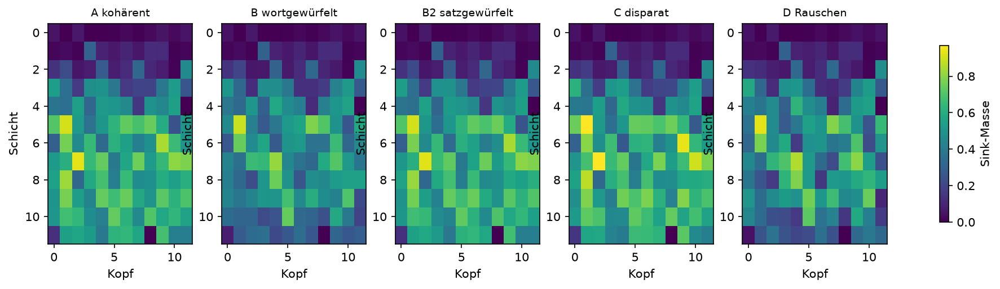
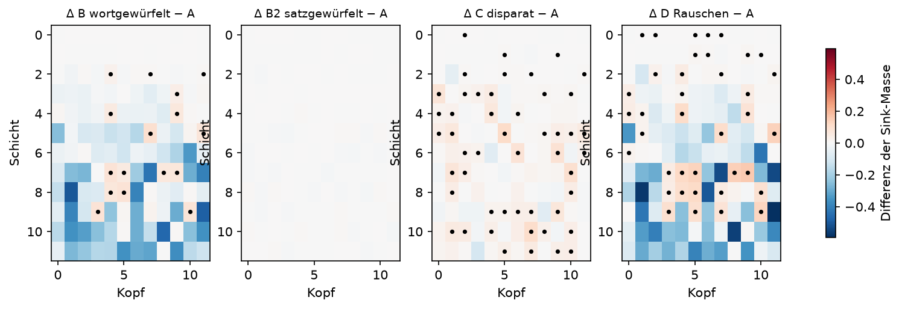

# Auswertung: gpt2 @ final

n = 30 Sequenzen pro Bedingung, N = 256, skip = 8, 12 Schichten × 12 Köpfe, 1000 Permutationen, 2000 Bootstraps.

## Übersicht

| Bedingung | Sink-Masse (95%-KI) | Ausgabe-Entropie | Loss |
|---|---|---|---|
| A kohärent | 0.4206 (0.4149–0.4262) | 3.346 | 3.200 |
| B wortgewürfelt | 0.3367 (0.3307–0.3430) | 6.232 | 6.636 |
| B2 satzgewürfelt | 0.4198 (0.4141–0.4256) | 3.463 | 3.368 |
| C disparat | 0.4323 (0.4288–0.4356) | 4.146 | 4.327 |
| D Rauschen | 0.3403 (0.3374–0.3431) | 7.661 | 8.636 |

Kontrolle: Der Loss sollte in A am niedrigsten und in D am höchsten sein. Ein auffällig niedriger Loss in A deutet auf auswendig gelernte Texte hin.

## H1: Asynchronizität erhöht die Sink-Masse

| Vergleich | Differenz | 95%-KI | p (einseitig) |
|---|---|---|---|
| B > A | -0.0839 | -0.0922 bis -0.0748 | 1.0000 |
| B2 > A | -0.0007 | -0.0084 bis +0.0075 | 0.5375 |
| C > A | +0.0117 | +0.0048 bis +0.0184 | 0.0010 |
| D > A | -0.0802 | -0.0866 bis -0.0741 | 1.0000 |
| D > B | +0.0037 | -0.0034 bis +0.0108 | 0.1508 |
| D > C | -0.0919 | -0.0966 bis -0.0876 | 1.0000 |

## Kopfweise Differenzen zu A (Benjamini-Hochberg, α = 0,05)

- B wortgewürfelt: 16 von 144 Köpfen signifikant erhöht
- B2 satzgewürfelt: 0 von 144 Köpfen signifikant erhöht
- C disparat: 49 von 144 Köpfen signifikant erhöht
- D Rauschen: 38 von 144 Köpfen signifikant erhöht

## H2: Folge und Art treiben verschiedene Köpfe in den Sink

- Schichtschwerpunkt ΔB (Folge zerstört): 6.32
- Schichtschwerpunkt ΔC (Art zerstört): 7.00
- Differenz C − B: +0.68 (95%-KI +0.16 bis +1.14); Vorhersage: positiv
- Korrelation der Karten ΔB und ΔC: r = -0.27 (95%-KI -0.38 bis -0.08); Vorhersage: schwach

Schichten sind ab 0 gezählt. Das Bootstrap resampelt A und B unabhängig, obwohl B aus A abgeleitet ist; die Intervalle sind daher eher konservativ.

## Grafiken

Punkte markieren Köpfe, die nach BH-Korrektur signifikant erhöht sind.